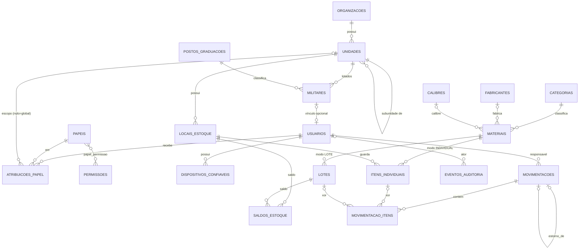

# DER preliminar (físico, MVP)

```mermaid
erDiagram
  ORGANIZACOES ||--o{ UNIDADES : possui
  UNIDADES ||--o{ UNIDADES : "subunidade de"
  UNIDADES ||--o{ LOCAIS_ESTOQUE : possui
  UNIDADES ||--o{ MILITARES : lotados
  POSTOS_GRADUACOES ||--o{ MILITARES : classifica
  MILITARES |o--o| USUARIOS : "vínculo opcional"
  USUARIOS ||--o{ ATRIBUICOES_PAPEL : recebe
  PAPEIS ||--o{ ATRIBUICOES_PAPEL : em
  UNIDADES |o--o{ ATRIBUICOES_PAPEL : "escopo (nulo=global)"
  PAPEIS }o--o{ PERMISSOES : papel_permissao
  USUARIOS ||--o{ DISPOSITIVOS_CONFIAVEIS : possui
  CATEGORIAS ||--o{ MATERIAIS : classifica
  FABRICANTES |o--o{ MATERIAIS : fabrica
  CALIBRES |o--o{ MATERIAIS : calibre
  MATERIAIS ||--o{ LOTES : "modo LOTE"
  MATERIAIS ||--o{ ITENS_INDIVIDUAIS : "modo INDIVIDUAL"
  LOCAIS_ESTOQUE ||--o{ ITENS_INDIVIDUAIS : guarda
  LOCAIS_ESTOQUE ||--o{ SALDOS_ESTOQUE : saldo
  LOTES ||--o{ SALDOS_ESTOQUE : saldo
  USUARIOS ||--o{ MOVIMENTACOES : responsavel
  MOVIMENTACOES ||--o{ MOVIMENTACAO_ITENS : contem
  MOVIMENTACOES |o--o| MOVIMENTACOES : "estorno_de"
  ITENS_INDIVIDUAIS |o--o{ MOVIMENTACAO_ITENS : "xor"
  LOTES |o--o{ MOVIMENTACAO_ITENS : "xor"
  USUARIOS |o--o{ EVENTOS_AUDITORIA : ator
```

Fonte de verdade do esquema: `backend/database/migrations/`. O DER definitivo depende de P-02, P-04 e P-05 (SRS §8).
